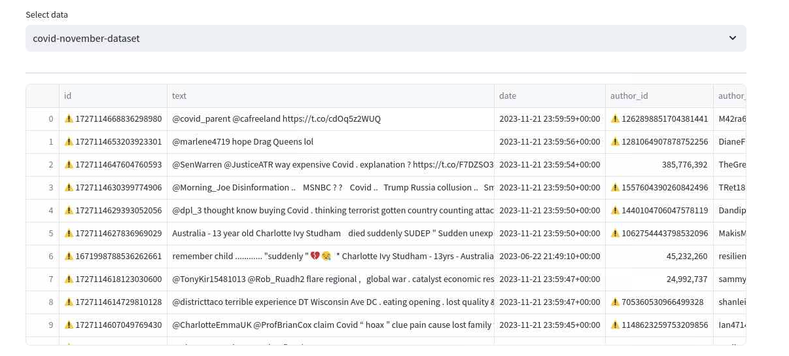
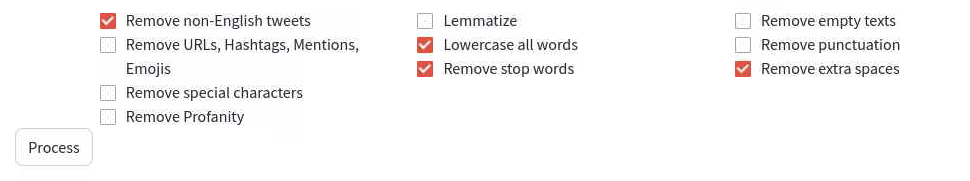
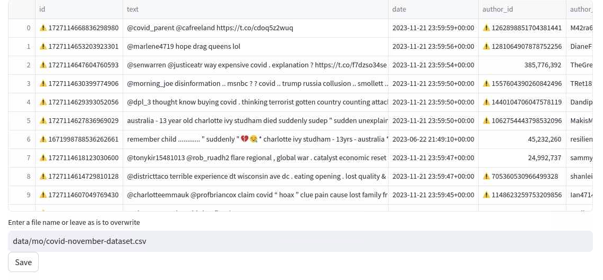

# Data Pre-processing
Following data collection in the previous tab, you can refine it through your desired cleaning operations.

## Step 1
Select the data file which you wish to clean.
A preview of the data in the file will be shown once you select the file name from the dropdown.

## Step 2
Various data cleaning operations are provided as shown in the screenshot below.
Select whichever applies and click on Process.

## Step 3
Preview and Save your data.

